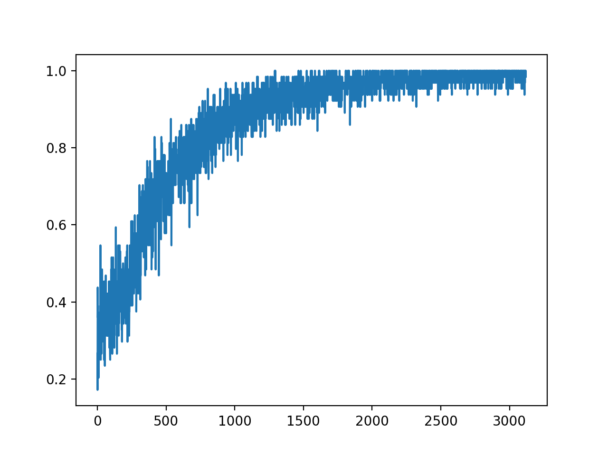
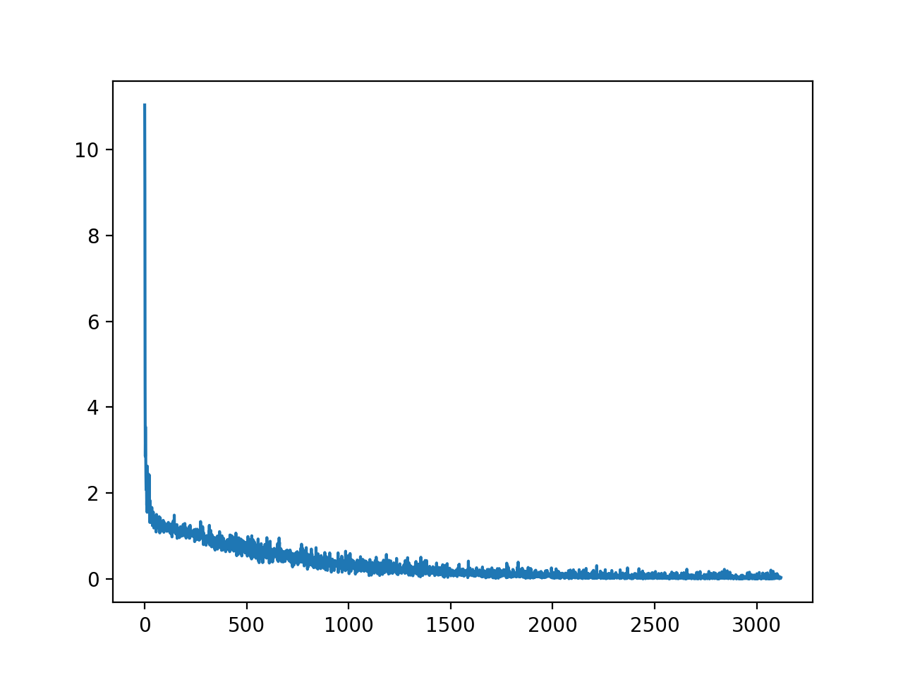
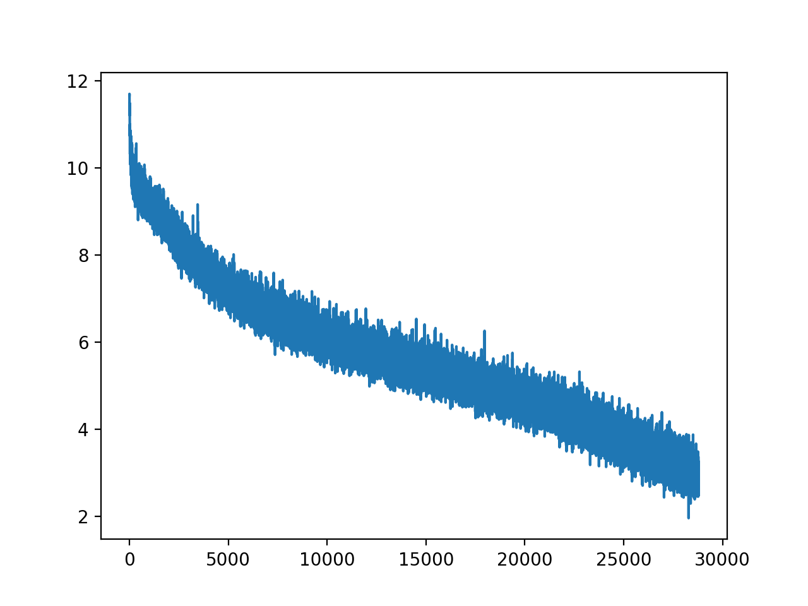

# Transformer Neural Network Building Blocks

[](https://www.python.org/downloads/)
[](https://www.tensorflow.org/)
[](https://opensource.org/licenses/MIT)

A collection of Transformer-based implementations for various NLP tasks, following the original paper [Attention Is All You Need](https://arxiv.org/abs/1706.03762).

## 🎯 Implemented Tasks

| Task | Description | Directory |
|------|-------------|-----------|
| **Machine Translation** | English-to-Chinese NMT using WIT3 dataset | [`en-zh_NMT/`](./en-zh_NMT/) |
| **Chinese Word Segmentation** | Sequence labeling with B/E/S/M tags | [`transformer_jieba/`](./transformer_jieba/) |
| **Text Classification** | Chinese text classification (THU-CTC) | [`transformer_text_Classfication/`](./transformer_text_Classfication/) |
| **Natural Language Inference** | Sentence entailment with Stanford SNLI | [`transformer_infersent/`](./transformer_infersent/) |
| **Reading Comprehension** | Extractive QA with Pointer Network | [`transformer_RC/`](./transformer_RC/) |

## 🚀 Quick Start

### Installation

```bash
# Clone the repository
git clone https://github.com/fooSynaptic/transfromer_NN_Block.git
cd transfromer_NN_Block

# Install dependencies
pip install -r requirements.txt
```

### Project Structure

```
transfromer_NN_Block/
├── Models/                          # Shared model definitions
│   └── models.py                    # Vanilla Transformer implementation
├── en-zh_NMT/                       # English-Chinese Neural Machine Translation
├── transformer_jieba/               # Chinese Word Segmentation
├── transformer_text_Classfication/  # Text Classification
├── transformer_infersent/           # Natural Language Inference
├── transformer_RC/                  # Reading Comprehension
├── images/                          # Training visualizations
├── results/                         # Model checkpoints
├── hyperparams.py                   # Hyperparameter configurations
└── requirements.txt                 # Python dependencies
```

---

## 📋 Task Details

### 1. Chinese Word Segmentation (Encoder-Decoder)

Train a sequence labeling model using **B/E/S/M** tagging scheme:
- **B** (Begin): Start of a word
- **E** (End): End of a word  
- **S** (Single): Single-character word
- **M** (Middle): Middle of a word

```bash
cd transformer_jieba

# Preprocess data
python prepro.py

# Train the model
python train.py

# Evaluate (BLEU score ~80)
python eval.py
```

---

### 2. English-Chinese Machine Translation

Dataset: [WIT3 (Web Inventory of Transcribed and Translated Talks)](https://wit3.fbk.eu/mt.php?release=2015-01)

```bash
cd en-zh_NMT

# Preprocess data
python prepro.py

# Train the model
python train.py

# Evaluate
python eval.py
```

**Results:**


---

### 3. Chinese Text Classification

Dataset: [THU Chinese Text Classification (THUCTC)](http://thuctc.thunlp.org/)

Categories:
```python
labels = {
    '时尚': 0, '教育': 1, '时政': 2, '体育': 3, '游戏': 4,
    '家居': 5, '科技': 6, '房产': 7, '财经': 8, '娱乐': 9
}
```

```bash
cd transformer_text_Classfication

# Preprocess and train
python prepro.py
python train.py

# Evaluate
python eval.py
```

**Results (10-class classification):**

| Metric | Score |
|--------|-------|
| Accuracy | 0.85 |
| Macro Avg F1 | 0.85 |
| Weighted Avg F1 | 0.85 |

<details>
<summary>Detailed Classification Report</summary>

```
              precision    recall  f1-score   support

           0       0.91      0.95      0.93      1000
           1       0.96      0.77      0.85      1000
           2       0.92      0.93      0.92      1000
           3       0.95      0.93      0.94      1000
           4       0.86      0.91      0.88      1000
           5       0.83      0.47      0.60      1000
           6       0.86      0.85      0.86      1000
           7       0.64      0.87      0.74      1000
           8       0.79      0.91      0.85      1000
           9       0.88      0.91      0.89      1000

    accuracy                           0.85     10000
   macro avg       0.86      0.85      0.85     10000
weighted avg       0.86      0.85      0.85     10000
```

</details>

---

### 4. Natural Language Inference (SNLI)

Dataset: [Stanford SNLI](https://nlp.stanford.edu/projects/snli/)

```bash
cd transformer_infersent

# Download and prepare data
wget https://nlp.stanford.edu/projects/snli/snli_1.0.zip
unzip snli_1.0.zip

# Preprocess
python data_prepare.py
python prepro.py

# Train
python train.py

# Evaluate
python eval.py --task infersent
```

**Training Progress:**

| Training Accuracy | Training Loss |
|-------------------|---------------|
|  |  |

**Evaluation Results (3-class: entailment, contradiction, neutral):**

| Metric | Score |
|--------|-------|
| Accuracy | 0.76 |
| Macro Avg F1 | 0.76 |

---

### 5. Reading Comprehension

Architecture: **Transformer Encoder** + **BiDAF Attention** + **Pointer Network**

```bash
cd transformer_RC

# Preprocess and train
python prepro.py
python train.py

# Evaluate
python eval.py
```

**Results:**

| Metric | Score |
|--------|-------|
| Rouge-L | 0.2651 |
| BLEU-1 | 0.36 |



---

## 🏗️ Model Architecture

The core Transformer implementation follows the original paper with:

- **Multi-Head Self-Attention**: Parallelized attention mechanism
- **Positional Encoding**: Sinusoidal or learned embeddings
- **Layer Normalization**: Pre-norm or post-norm variants
- **Feed-Forward Networks**: Position-wise fully connected layers
- **Residual Connections**: Skip connections for gradient flow

### Key Hyperparameters

| Parameter | Default Value |
|-----------|---------------|
| Hidden Units | 512 |
| Attention Heads | 8 |
| Encoder/Decoder Blocks | 5 |
| Dropout Rate | 0.1 |
| Learning Rate | 0.0001 |
| Batch Size | 32-64 |

---

## 📚 References

- [Attention Is All You Need](https://arxiv.org/abs/1706.03762) (Vaswani et al., 2017)
- [Kyubyong's Transformer Implementation](https://github.com/Kyubyong/transformer)
- [Stanford SNLI Dataset](https://nlp.stanford.edu/projects/snli/)
- [THU Chinese Text Classification](http://thuctc.thunlp.org/)

---

## 📝 License

This project is licensed under the MIT License - see the [LICENSE](LICENSE) file for details.

---

## 🤝 Contributing

Contributions are welcome! Please feel free to submit a Pull Request.

---

**⭐ If you find this project helpful, please consider giving it a star!**
