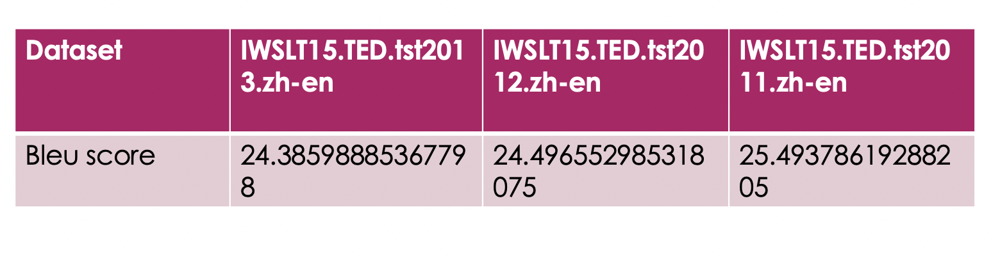

# English-Chinese Neural Machine Translation

This module implements an English-to-Chinese Neural Machine Translation (NMT) system using the Transformer architecture.

## Dataset

**WIT3 (Web Inventory of Transcribed and Translated Talks)**

- Source: [IWSLT 2015 MT Track](https://wit3.fbk.eu/mt.php?release=2015-01)
- Domain: TED Talk transcriptions
- Language pair: English → Chinese

## Quick Start

### 1. Data Preparation

Download and preprocess the WIT3 dataset:

```bash
# Preprocess the data
python prepro.py
```

This will create vocabulary files and prepare the training data in the `./preprocessed/` directory.

### 2. Training

```bash
python train.py
```

Training logs and checkpoints will be saved to `seq2seq_model_dir/`.

### 3. Evaluation

```bash
python eval.py
```

## Results



## Model Architecture

- **Encoder**: 5-layer Transformer encoder
- **Decoder**: 5-layer Transformer decoder with cross-attention
- **Hidden Units**: 512
- **Attention Heads**: 8
- **Dropout Rate**: 0.1

## File Structure

```
en-zh_NMT/
├── data_load.py    # Data loading and batch generation
├── data_pre.py     # Data preprocessing utilities
├── eval.py         # Model evaluation
├── modules.py      # Transformer building blocks
├── prepro.py       # Vocabulary and data preprocessing
├── train.py        # Training script
└── README.MD       # This file
```

## References

- [Attention Is All You Need](https://arxiv.org/abs/1706.03762)
- [WIT3 Dataset](https://wit3.fbk.eu/)
